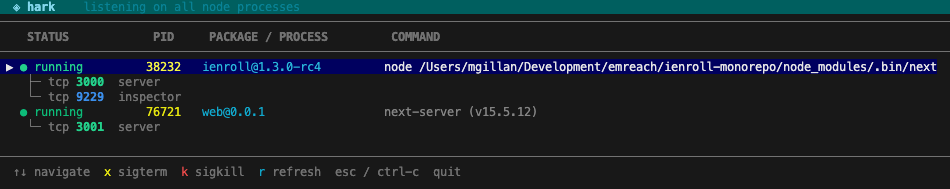

# ◈ hark

> **hark** /hɑːrk/ — *to listen carefully*. An interactive terminal UI for inspecting and managing Node.js processes listening on ports.


---

## Why hark?

`lsof -i :3000` tells you *something* is listening on a port. It doesn't tell you *what*. When you have five `node` processes running and need to kill the right one, the standard output is nearly useless:

```
node  81063 mgillan  17u  IPv6 0x887aa8beeeeb7d3b  0t0  TCP *:hbci (LISTEN)
```

**hark** solves this. It resolves the process's working directory, reads its `package.json`, labels well-known ports (server, inspector, vite, hmr…), and gives you a live interactive table you can navigate and act on — all in your terminal, no dependencies.

---

## Features

- **Live TUI** — auto-refreshes every 4 seconds; redraws cleanly on terminal resize
- **Grouped by process** — one row per PID; a single process listening on multiple ports (e.g. `3000` + `9229` inspector) appears as one selectable entry
- **Node.js enrichment** — resolves `package.json` name and version from the process's working directory
- **Port labelling** — definitively identifies the Node.js inspector port (`9229`/`9230`); heuristically labels common dev ports (`vite`, `storybook`, `hmr`, `astro`, etc.)
- **Graceful kill flow** — `x` sends `SIGTERM` and waits 2.5 seconds; if the process doesn't exit it's marked ⚠ *not responding* so you can follow up with `k` (`SIGKILL`)
- **No dependencies** — pure Node.js; uses `lsof` and `ps` which are built into macOS

---

## Installation

```bash
# Download (or clone the repo), then:
chmod +x hark

# Either (requires sudo):
sudo mv hark /usr/local/bin/hark

# Or, without sudo:
mkdir -p ~/.local/bin
mv hark ~/.local/bin/hark
# Make sure ~/.local/bin is on your PATH
```

No npm install. No Homebrew formula (yet). Just a script on your `$PATH`.

---

## Usage

```bash
# Show all listening Node.js processes
hark

# Filter to a specific port
hark 3000
```

### Keybindings

| Key | Action |
|-----|--------|
| `↑` / `↓` | Navigate between processes |
| `x` | Send `SIGTERM` (graceful shutdown) |
| `k` | Send `SIGKILL` (force kill) |
| `r` | Manual refresh |
| `esc` / `ctrl-c` | Quit |

---

## What it looks like



```
  ◈ hark    listening on all node processes
────────────────────────────────────────────────────────────────────────────────
    STATUS            PID     PACKAGE / PROCESS         COMMAND
────────────────────────────────────────────────────────────────────────────────
  ▶ ● running         38232   ienroll@1.3.0-rc4         node /projects/ienroll/node_modules/.bin/next
    ├─ tcp 3000  server
    └─ tcp 9229  inspector

    ● running         41089   my-api@2.4.1              node dist/server.js --port 8080
    └─ tcp 8080  server

────────────────────────────────────────────────────────────────────────────────
  ↑↓ navigate  x sigterm  k sigkill  r refresh  esc / ctrl-c  quit
```

### Kill flow

Pressing `x` on a process:

1. Sends `SIGTERM`
2. Locks the UI and waits 2.5 seconds (configurable via `SIGTERM_WAIT` in the script)
3. Checks if the process is still alive
   - **Stopped** → row is removed, status message confirms success
   - **Still running** → row turns red and is marked `⚠ not responding`; press `k` to force kill

---

## Port label reference

| Port | Label | Notes |
|------|-------|-------|
| `9229` / `9230` | `inspector` | Node.js debugger — **definitive** |
| `3000` / `3001` / `4000` / `8000` / `8080` | `server` | Common dev server ports |
| `5173` / `5174` | `vite` | Vite dev server |
| `4321` | `astro` | Astro dev server |
| `6006` | `storybook` | Storybook |
| `8888` | `notebook` | Jupyter / similar |
| `24678` | `hmr` | Vite HMR websocket |
| everything else | `tcp` | Unknown / unlabelled |

You can extend the `PORT_LABELS` map at the top of the script with your own entries.

---

## Requirements

- **macOS** (uses `lsof` with macOS-specific flags and `ps -o command=`)
- **Node.js** — any version with `require`; no additional packages needed
- Standard macOS CLI tools: `lsof`, `ps`

Linux support is not currently planned but contributions are welcome — the main differences are in the `lsof` flags and `ps` output format.

---

## Caveats

- **Permissions** — if a process was started by a different user, `lsof` may not be able to resolve its working directory. Run `sudo hark` in that case.
- **Port labels** — only `9229`/`9230` are definitively identified (they are the hardcoded Node.js inspector defaults). All other labels are heuristic; a process on port `3000` might not be a web server.
- **Non-Node processes** — when invoked with a specific port (`hark 3000`), hark shows all processes on that port regardless of name. In no-argument mode it filters to `node` processes only.

---

## Contributing

PRs are welcome. The script is intentionally a single file with no build step — keep it that way.

Things that would be great:
- Linux compatibility
- Additional port labels (open a PR or issue with the port, its canonical use, and a source)
- `--json` output mode for piping to other tools

---

## Authors

- **Mike Gillan** — concept, product direction, and requirements
- **Claude Sonnet 4.6** (Anthropic) — implementation

Built interactively in a single session. The name was Claude's idea.

---

## License

MIT — do whatever you like with it.
